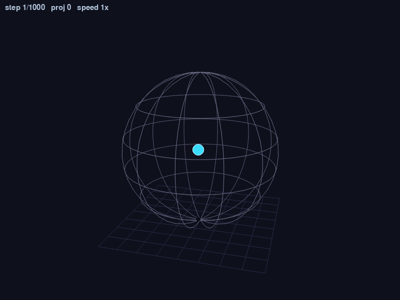
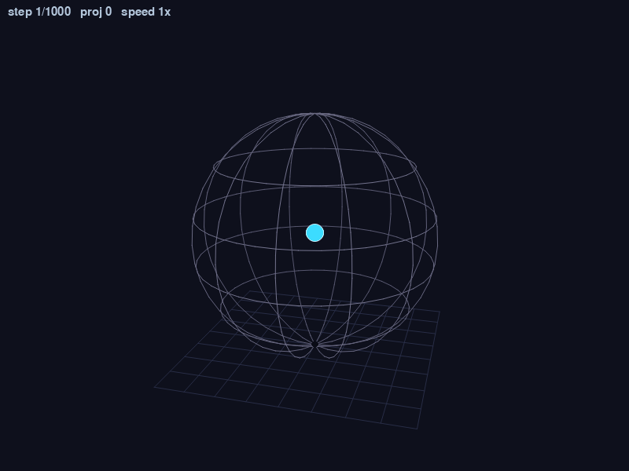

# RL Dodging Agent: An Honest Investigation

| Before predictive aim | After predictive aim |
|:---:|:---:|
|  |  |
| **Before:** the agent learned to slide along the inner boundary, outrunning the ballistic projectile aim. Survival climbed; intelligence didn't. | **After predictive aim was added:** the trained agent learned that *randomness* is the survival strategy when projectiles predict your motion. Sampled actions ≈ random walk. |

## What this is

I built a PPO agent to dodge projectiles in a 3D spherical arena. I expected
to demonstrate "PPO learns reactive dodging." Instead I demonstrated something
more interesting: how hard it is to design an environment where the optimal
policy is the policy you intended. This repo is the artifact of that
investigation — a few hundred lines of env + PPO + diagnostics, and the
lessons I extracted from watching it fail in three different ways.

## Quick results

| Policy | Survival (mean steps over 30–50 episodes) |
|---|---|
| Random baseline | ~695 |
| Stay still at any position | ~310 |
| Constant slide (the original boundary-camper, in the original env) | ~410 |
| Same constant slide in the *current* env with predictive aim | ~290 |
| Trained PPO, deterministic argmax | ~436 |
| Trained PPO, stochastic sampling | ~755 |

The gap between the deterministic-argmax score (436) and the stochastic
score (755) is the whole story: the trained policy is a near-uniform
distribution over actions. Sample from it and you get a random walk that
defeats the predictor (755). Take argmax and you get one fixed action
repeated every step, which is exactly what the predictor catches (436).

## What I learned

Ordered by how transferable they are to future RL projects:

1. **Diagnostics catch what intuition misses.** Watching a GIF of the
   boundary-sliding agent looked plausibly like "the agent learned to evade."
   Only when I logged the per-step position distribution did I see
   `mean(‖pos‖/R) = 0.89` with 92% of steps clipped to the containment
   sphere. Visual inspection lies; numbers don't.

2. **Specification gaming survives env redesigns.** The earlier 2D-cube
   env's corner-camping was supposedly "fixed" by moving to a sphere. The
   sphere version then exhibited boundary-camping. Adding rotational
   symmetry to the env didn't make the policy rotationally symmetric — it
   just rotated the same exploit to a different world direction each episode.
   Each round of env "cleanup" exposed a deeper version of the same problem.

3. **"Clean environment" is harder to define than it looks.** Geometric
   symmetry (random-agent statistics look symmetric) doesn't guarantee
   no-exploit. The interaction between agent behavior and env dynamics
   creates exploits invisible in the env's static structure. The
   threat-distribution diagnostic showed me that the sphere boundary
   *wasn't* objectively safer for a stationary agent — but it became safer
   the moment the agent started *moving*, because predictable motion in a
   bounded space curves in ways the projectile predictor couldn't anticipate.

4. **PPO's failure modes are mirror images.** Early sessions: agent commits
   too hard to a degenerate strategy (slide). Late sessions: agent refuses
   to commit at all because committing is punished (random walk). Both
   are local optima; both look very different from the "intended"
   reactive-dodging optimum. The same algorithm produced both.

5. **Reward shape determines what's learnable.** A flat reward (+1/step
   while alive) gives no signal for "partial dodging." Random walking
   already saturates the reward — any reactive-dodging policy has to
   compete with random walking from the start, which means there's no
   incremental gradient toward it. PPO can't climb a hill that doesn't
   exist.

6. **The 5-variable PPO log diagnostic transfers.** `mean_ep_len` rising,
   `v_loss` falling, `entropy` slowly declining, `clipfrac` in [0.05, 0.25],
   `pg_loss` meaningfully non-zero. These five tell you whether *any* PPO
   setup is learning, regardless of env. Conversely: when entropy didn't
   decline in this project's final run, that was the early signal that PPO
   was settling for "be random" rather than committing to a strategy.

7. **Best-checkpoint tracking is load-bearing.** PPO peaks and regresses.
   Without saving the rolling-best separately from the latest, you measure
   the regressed policy and conclude "PPO doesn't work here." This is the
   single cheapest infrastructure improvement to a PPO training loop and
   it pays back every run.

8. **One-variable-at-a-time saved this project.** Every time I changed
   multiple env knobs or hyperparameters simultaneously, I couldn't
   attribute the result. The discipline of (a) re-run the random baseline,
   (b) change one thing, (c) re-baseline, (d) train, is what made the
   diagnostic story coherent. Skipping that discipline once cost me a
   couple of hours chasing a phantom regression.

## What's in this repo

```
.
├── dodge_env.py            # the env + physics + perspective renderer
├── ppo_agent.py            # PPO trainer + ActorCritic network
├── watch_agent.py          # load checkpoint -> watch / eval / GIF
├── random_agent.py         # random-action baseline
├── position_diagnostic.py  # is the agent symmetric? pinned to surface?
├── trajectory_classifier.py# sitting / sliding / orbiting / bouncing?
├── threat_diagnostic.py    # which positions are *objectively* safer?
├── make_journey_gifs.py    # rebuild the before/after GIFs at the top of this README
├── checkpoints/
│   ├── ppo_dodge.pt              # latest weights
│   ├── ppo_dodge_best.pt         # rolling-best (the one watch/eval loads by default)
│   └── ppo_dodge_high_ent_best.pt# archived pre-polish checkpoint
├── logs/                   # training console output
├── assets/                 # the GIFs above
├── GLOSSARY.md             # every term in the PPO log, in plain English
├── requirements.txt        # pinned versions
└── README.md
```

## How to reproduce

### Setup

```bash
# Python 3.9+ recommended (this was developed on 3.9)
python3 -m venv .venv
source .venv/bin/activate
pip install -r requirements.txt
```

### The full pipeline, in order

```bash
# 1. Random baseline — what dumb luck gets you in this env
python3 random_agent.py --episodes 30

# 2. Train PPO from scratch — ~5 minutes on CPU for 1M steps
python3 ppo_agent.py --steps 1_000_000 2>&1 | tee logs/training.log

# 3. Polish stage — lower entropy coefficient, resume from best
#    (Manually drop ENT_COEF in ppo_agent.py first; default polish is 0.001.)
cp checkpoints/ppo_dodge_best.pt checkpoints/ppo_dodge_high_ent_best.pt
python3 ppo_agent.py --steps 2_000_000 \
    --resume checkpoints/ppo_dodge_high_ent_best.pt 2>&1 | tee logs/training_polish.log

# 4. Evaluate (deterministic argmax)
python3 watch_agent.py --mode eval --episodes 30

# 5. Evaluate (stochastic sampling — usually a much higher number)
python3 watch_agent.py --mode eval --episodes 30 --stochastic

# 6. Run the diagnostic suite
python3 position_diagnostic.py --policy ppo --episodes 30
python3 trajectory_classifier.py --episodes 10
python3 threat_diagnostic.py --episodes 100

# 7. Watch live (interactive — drag to orbit, wheel to zoom, ESC to quit)
python3 watch_agent.py --mode human

# 8. Rebuild the README GIFs
python3 make_journey_gifs.py
```

### Window controls (any `human` render)

| Input | Effect |
|---|---|
| Left-mouse drag | Orbit camera (azimuth + elevation) |
| Arrow keys | Orbit camera (held = continuous) |
| Mouse wheel | Zoom in / out |
| `1`–`5` | Set playback speed to 1× / 2× / 4× / 8× / 16× |
| `R` | Reset camera to default |
| `ESC` or window X | Quit cleanly |

## Limitations and what I'd do differently

- **The final agent doesn't actually dodge.** Under deterministic argmax it
  scores worse than random; under stochastic sampling it scores about the
  same as random. The "trained agent" is approximately a randomness-generator.
  Calling it a "trained PPO dodging policy" would be misleading.

- **The env's reward structure doesn't gradient toward reactive dodging.**
  This is fixable in principle (denser projectiles, distance-based reward
  shaping, smaller AIM_RADIUS, sparse reward only on actual dodge events).
  I didn't fix it — I learned the lesson and stopped the iteration.

- **No comparison against other RL algorithms.** Only PPO. A DQN, SAC, or
  even an evolutionary search might hit very different local optima. The
  "PPO can't learn this" finding is specifically about PPO with these
  hyperparameters in this env. It does not generalize.

- **No architecture experiments.** All training used the same 64-hidden
  tanh MLP. A recurrent policy might use temporal context to dodge; a
  symmetry-equivariant net might handle the env's rotational structure
  differently. I picked the simplest thing and stuck with it.

- **Single seed for most experiments.** I should have run multiple seeds
  and reported variance. Some of the survival numbers in this README are
  30-episode samples — the standard error on the mean is ~50 steps, which
  is large compared to the differences I was claiming.

- **The diagnostic was added late.** The corner-camping in the cube env was
  there from session 1. I trained against a leaky env for the equivalent of
  two sessions before building the diagnostic that exposed it. The lesson:
  build the diagnostic before you trust the result, not after the result
  starts to feel suspicious.

- **The slide-vs-random comparison is fragile.** The mechanical reason the
  slide *used to* work (in the ballistic-aim env) was that AGENT_SPEED >
  PROJECTILE_SPEED. Slightly different physical constants would have
  produced a different exploit and a different story. The lessons are
  generalizable; the specific numbers in this repo are not.

## What's next

The next iteration of this project will move to Unity. The goal isn't to
rebuild the dodging task — it's to take what I learned here about env
design, reward shaping, and diagnostic discipline, and apply it to a
richer environment (likely a hide-and-seek style multi-agent setup).

The single biggest design instinct I'm carrying forward: **design the
reward landscape so the policy you want is reachable by gradient from a
random policy**. That's the lesson the dodging env failed at. In a
hide-and-seek setting that means rewarding *distance from the seeker*
(continuous gradient even before the agent figures out hiding spots),
not just *didn't get caught* (flat reward, every non-caught policy
equally good).

A useful pre-flight check for any future RL env: *Could a random agent
receive any of this reward?* If no, the reward is too sparse for cold-start
learning. If yes but the random agent saturates it (as in this project),
the reward doesn't gradient toward improvement.

## See also

- **[GLOSSARY.md](GLOSSARY.md)** — every term that shows up in the training
  log and the hyperparameter block, with a short explanation. The PPO-
  vocabulary content (time units, loss components, clip mechanism) is
  generic reference material useful for any PPO project.
